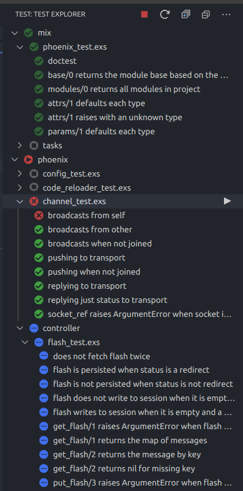

# Elixir Test Adapter

## Features

Shows Elixir tests in a sidebar. Scans all your elixir projects in your workspace.

**NOTE:** It also works with a multi-workspace environment.

## Settings

This extension contributes the following settings:

- `elixirTestExplorer.enable`: enable/disable this extension

## Changelog

See Changelog [here](CHANGELOG.md)

## Issues

Submit the [issues](https://github.com/adamzapasnik/vscode-elixir-test-explorer/issues) if you find any bug or have any suggestion.

## Contribution

Fork the [repo](https://github.com/adamzapasnik/vscode-elixir-test-explorer) and submit pull requests.
